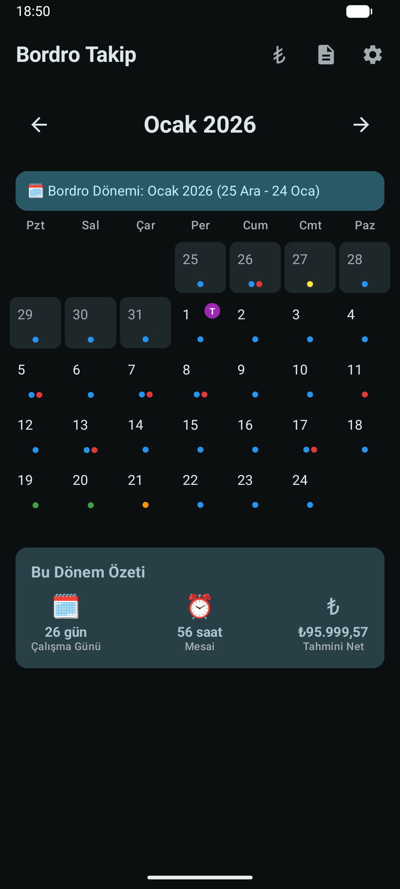
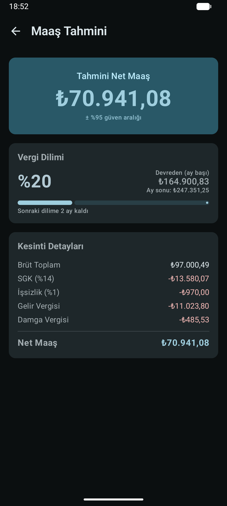
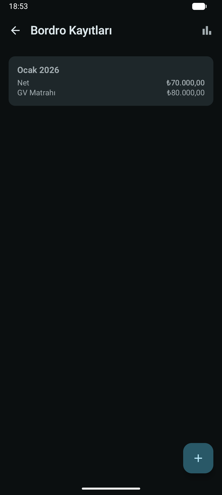
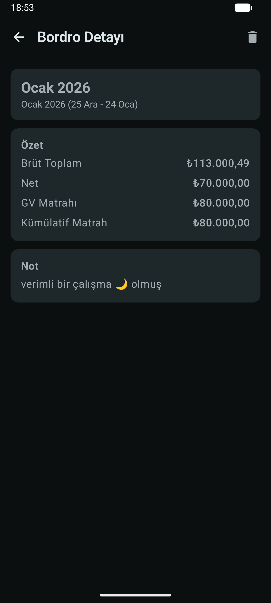
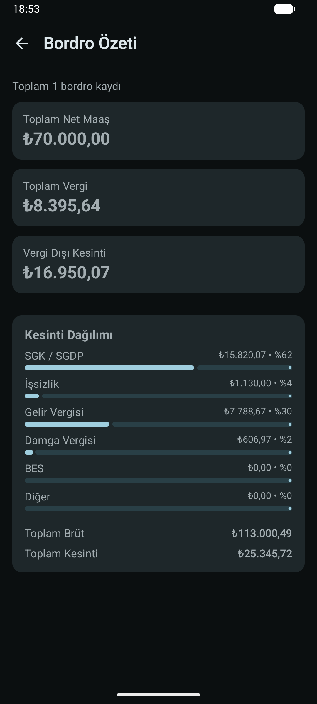
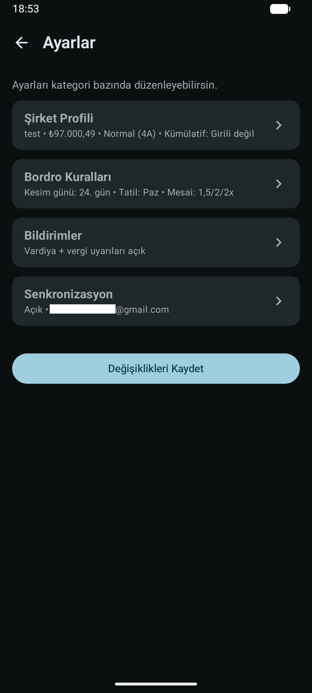

<div align="center">
  
  <h1>Bordro Takip</h1>
  <p>Vardiya, mesai, izin ve maaş tahmini için modern bordro takip uygulaması.</p>

  <p>
    <a href="https://github.com/xinzore/BordroTakip/releases/download/423.4.9/BordroTakip.apk">
      
    </a>
  </p>

  <p>
    <a href="https://github.com/xinzore">Geliştirici GitHub</a> •
    <a href="https://github.com/xinzore/BordroTakip">Uygulama Repo</a> •
    <a href="https://xinzore.vercel.app">Geliştirici Websitesi</a>
  </p>
</div>

---

## ✨ Öne Çıkanlar

- 📅 Takvim tabanlı vardiya / mesai / izin yönetimi
- 🧾 Bordro fotoğrafı içe aktarma + OCR ile otomatik alan doldurma
- 💰 Güncel vergi ve kesinti mantığıyla net maaş tahmini
- 🔔 Vardiya hatırlatma ve vergi dilimi bildirimleri
- 🔄 Google Takvim senkronizasyonu
- ⚙️ Esnek ayarlar: kesim günü, hafta tatili, mesai katsayıları, BES, çalışma statüsü

## 📱 Ekran Görüntüleri

<table>
  <tr>
    <td></td>
    <td></td>
    <td></td>
  </tr>
  <tr>
    <td></td>
    <td></td>
    <td></td>
  </tr>
</table>

## 🚀 Kurulum (Geliştirici)

```bash
./gradlew assembleDebug
```

APK çıktısı:

```text
app/build/outputs/apk/debug/app-debug.apk
```

## 🧩 Proje Yapısı

```text
app/        # Android uygulama kaynak kodları
gradle/     # Gradle wrapper ve version catalog
```

## 📦 Hızlı İndirme

- APK: https://github.com/xinzore/BordroTakip/releases/download/423.4.9/BordroTakip.apk

---

<div align="center">
  Bordro Takip • Android • Kotlin • Jetpack Compose
</div>
